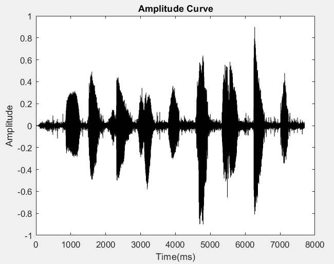

# Main Takeaway

我们小组决定实现变声器。

全部思路均来自于网上，链接见References，感谢前人的努力工作和伟大的开源精神。


# Intro


人声的两大特点来自于基频和共振峰

- 基频即为发出浊音时声带自然振动的频率
- 共振峰则是之声门波在声道里发生共鸣的频率。共振峰的主要影响因素是声道的长度：声道越长共振峰的频率越高，反之亦然。


# 变声器原理

计算机中的数字音频的存储方式被称之为 `PCM`（脉冲编码调制），声音的高低变换被转化为一系列高低电平的二进制编码。在此过程中有三个主要反映其特征的参数：采样率、通道数和位深：

- 采样率：即每秒采样的次数，单位为 Hz

- 通道数：也就是音轨数。由于自然界许多声音的混叠将会导致计算处理的困难，而如果又要重现出富有层次感的丰富声音效果，我们就需要使用到更多的通道（音轨）
- 位深：直观反映了声音的振幅范围。利用计算机常见的补码编码一个幅度的分度范围从而显示对不同振幅的模拟。

 `wav`文件的流就是 `PCM`编码，因此也被称为原始音频文件。其他类型的编码，都是对此进行了有损或是无损的压缩，降低了存储量的消耗

| 人群 | 基频分布（Hz) | 共振峰频率分布 |
| ---- | ------------- | -------------- |
| 男声 | [50,180]      | 偏低           |
| 女生 | [160,380]     | 中             |
| 童声 | [400,1000]    | 偏高           |


## 变声处理步骤

### 得到频域

利用FFT来处理音频信号：根据信号时域长度分析选择帧长


### 频域操作

考虑到男女声的音调本身的差异，第一个直观的操作就是进行变调

1. 采样率重采样：通过增添或删去部分采样点来实现

2. 在进行了频率的升高后，为了解决由第一步带来的声音长度变化问题，我们需要进行时域压缩或者延拓——完成时域的时长修正（TSM：Time-scale modification）

   

3. 逆变换回时域


1. 利用重采样,实现变调变速
2. 利用相位声码器,实现变速不变调


# MATLAB对音频操作

[【MATLAB】关于音频处理的一些常用函数总结](https://blog.csdn.net/Magician0619/article/details/104778202)


# 代码实现日志

## 直接分析音频

1-9男有噪音




1-9女有噪音


根据男生、女生的基频判断，噪声非常大，我们需要加窗滤掉高频噪声


## 基频追踪

- 低通滤波

  由于语音信号中可能有高频噪声，或者是语音本身的共振峰，都会影响自相关函数的计算。当信号中有高频成分时，自相关函数会计算出多个波峰，而基频的计算是根据自相关函数的波峰位置确定的，波峰太多会提高后续基频筛选的难度，因此需要用低通滤波滤除。低通滤波的截止频率一般选取600Hz，这是考虑到有些人在说话时基频可能能够达到600Hz；

- 峰值检测

  除了排除清音以外，如果判断到当前帧是噪声，也需要跳过基频计算的步骤，这样可以避免错误的基频。我在算法中用了最简单的峰值检测来判断是否是噪声，这是基于一个假设：噪声段的信号强度一般小于语音段的信号强度，只要检测一帧内的最大峰值是否大于某个阈值，就可以判断这一帧是否是噪声。

滤波后效果如下：


我们采用简单的基频估计方法，它假设基频对应的幅度最大

男声：

```
The base frequency is: 122.8299 Hz
```

女声：

```
The base frequency is: 226.3318 Hz
```

符合查询得到的人群基频分布


## 信号重构


利用重采样,实现变调变速


# References

- [变声导论-变声器原理及实现(核心算法实现篇)](https://zhuanlan.zhihu.com/p/110278983)
- [变声导论-变声器原理及实现(基音分类与滤波系统实现) - 知乎 (zhihu.com)](https://zhuanlan.zhihu.com/p/111889443)
- [人声变声器的原理_变声软件 原理](https://blog.csdn.net/zhuoqingjoking97298/article/details/125581253)

- [分享matlab程序之——滤波器篇（高通，低通） - tkppain - 博客园 (cnblogs.com)](https://www.cnblogs.com/tkppain/p/6691052.html?utm_source=itdadao&utm_medium=referral)
- [数字信号处理大作业——基于matlab R2019a的男声变女声资料汇总与代码_数字信号处理 男声变女声-CSDN博客](https://blog.csdn.net/weixin_46279604/article/details/109252160)

- [【MATLAB】关于音频处理的一些常用函数总结-CSDN博客](https://blog.csdn.net/Magician0619/article/details/104778202)

- [变声算法实现（基频追踪+SOLA）_voice morph-CSDN博客](https://blog.csdn.net/qq_36787927/article/details/105958824)
